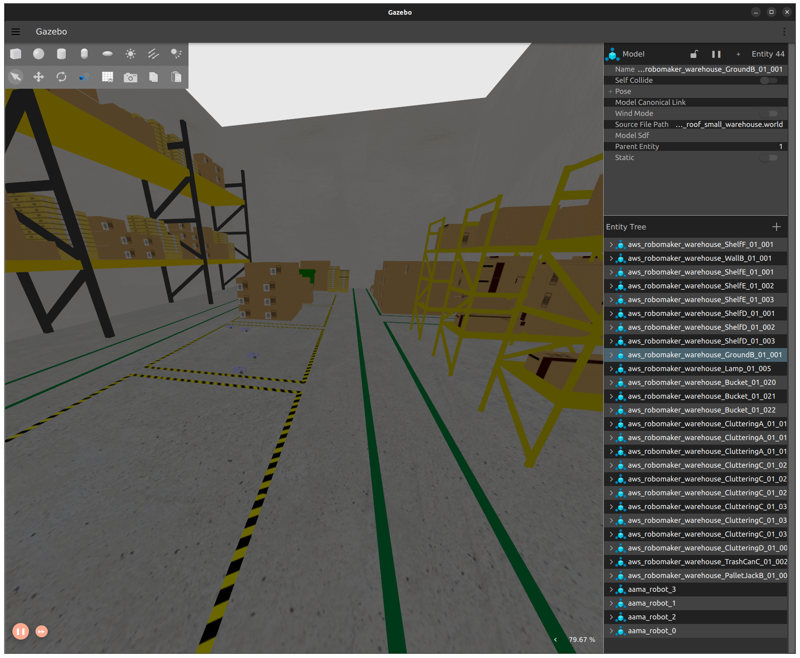
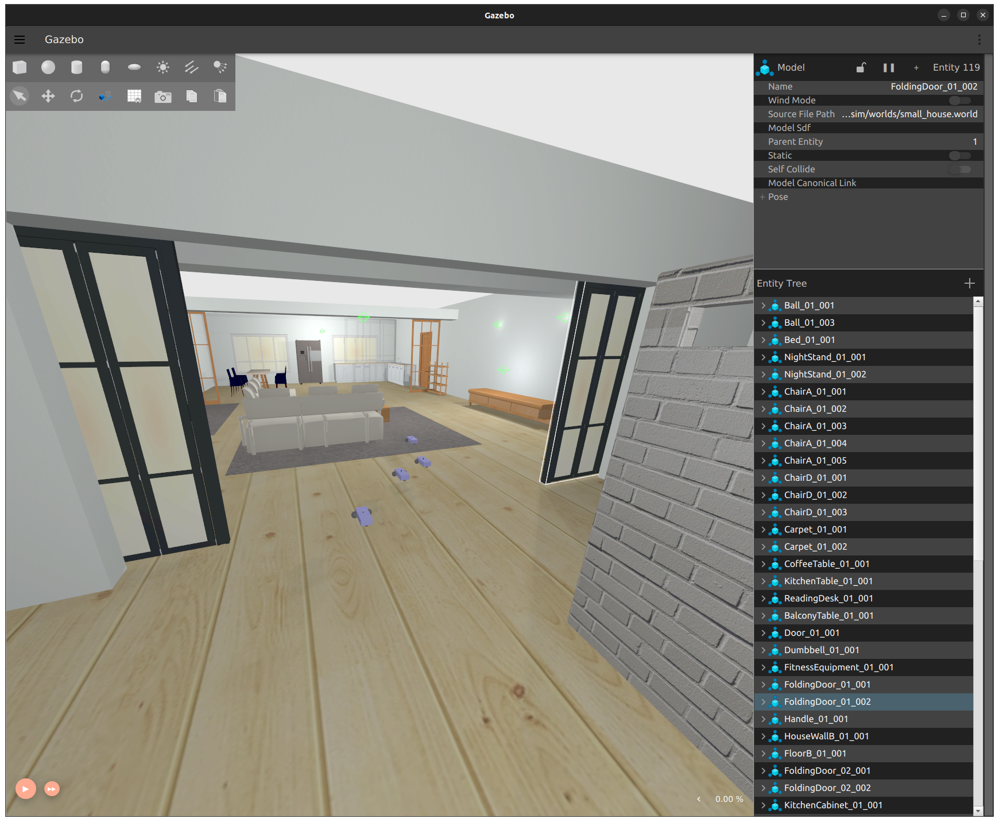
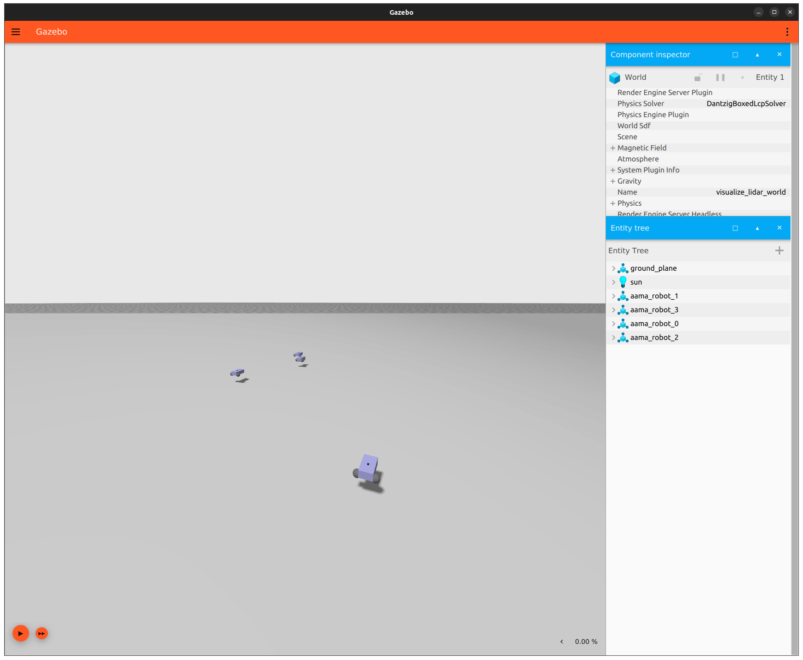

# AAMA-Sim

A multi-agent enhanced simulation tool can leverage programming abstraction
by empowering the development, validation, and system realization phases. The
software agent code used in the simulation can also be reused for the physical
implementation, as the agent paradigm provides higher-level programming and
modularisation for the target system.
## Installation

- Create a ROS2 Workspace
  ```
   cd ~
   mkdir -p ros2_ws/src && cd ros2_ws
  ```

- Clone AAMA-Sim Repository into `src` of ROS2 Workspace
  ```
   cd ~/ros2_ws/src
   git clone https://github.com/micss-lab/AAMA-sim.git
  ```

- Please install the requirements. Follow [here](setup.md).


- Build the ROS2 Workspace
  ```
   cd ~/ros2_ws
   colcon build
  ```

- Add the ROS2 Workspace and Gazebo Model Path to Bashrc
  ```
   echo "source /opt/ros/humble/setup.bash" >> ~/.bashrc
   echo "source ~/ros2_ws/install/local_setup.bash" >> ~/.bashrc
   echo "export IGN_GAZEBO_RESOURCE_PATH=:~/ros2_ws/src/AAMA-sim/models" >> ~/.bashrc
   source ~/.bashrc
  ```

## How to Use AAMA-Sim

### How to Run Multi Robot Simulation

- Run with Multiple Robots. This Launch file will open a Gazebo instance with
  2 Robot instances in Warehouse world by default.
  ```
   ros2 launch aama_sim aama_sim.launch.py
  ```

    - Make Sure RabbitMQ Docker Container is up and running. If not use commands below to create a RabbitMQ container.
    - Dont forget to click the play button on the bottom left of Gazebo window.

### How to Change Robot Count and World Environment in Simulation

- In order to change the number of robots in the simulation you have to add some command line arguments to the launch
  file.
  ```
   ros2 launch aama_sim aama_sim.launch.py world_name:='house' robot_count:=4
  ```
  to get the detailed description of the arguments you can use the following command.
  ```
   ros2 launch aama_sim aama_sim.launch.py -s
  ```

#### World Environments

- Available World Environments
    - `Warehouse`
      
    - `House`
      
    - `Empty`
      

### How to Modify the Simulation Environment

The worlds in AAMA-sim is defined by the [SDF World](http://sdformat.org/spec?ver=1.11&elem=world) standard.
To modify the simulation environment, you can modify the respective world file under the `worlds` folder in
the `AAMA-sim` package.

Developers can add/remove models, change the lighting, and modify the physics properties of the world. By following the
Gazebo Sim [documentation](https://gazebosim.org/docs/citadel/sdf_worlds).

### How to Modify the Robot Model

The robot model in AAMA-sim is defined by the [SDF Model](http://sdformat.org/spec?ver=1.11&elem=model) standard.
To modify the robot model, you can modify the `aama_robot.sdf` file under the `models/aama_robot` folder in
the `AAMA-sim` package.

Developers can add/remove sensors, change the physical properties, and modify the visual properties of the robot model.
By following the Gazebo Sim [documentation](https://gazebosim.org/docs/citadel/building_robot).

However, after adding a new sensor, you need to implement a sensor interface in the `AAMA-sim` package to publish the
sensor data to the RabbitMQ message broker.
In order to be able to publish the sensor data to the RabbitMQ message broker, you need to create a new RabbitMQ message
queue and publish the sensor data to the created message queue.
You can check the existing sensor interfaces in the `AAMA-sim` package to implement a new sensor interface.

An example empty sensor interface is provided in the `AAMA-sim` package
under `aama_sim/simulation_interface/empty_sensor_interface.py` to help you implement a new sensor interface.

### Sensor and Control Messages

#### Available Sensors

| Sensor Name    | ROS Topic                         | RabbitMQ Topic |
|----------------|-----------------------------------|----------------|
| IMU            | `/imu`                            | `imu`          |
| Sonar          | `/sonar`                          | `sonar`        |
| UWB            | `/model/{robot_name}/pose_static` | `uwb`          |
| Logical Camera | Not Available                     | Not Available  |
| Camera         | Not Available                     | Not Available  |
| LIDAR          | Not Available                     | Not Available  |

#### Robot Control Message

- RabbitMQ Message Queue Name: `/robot_ctrl`
- Message
  Type: `RobotMsgs/RobotControl.java` ([Check here](https://github.com/micss-lab/AAMA-example-agents/blob/main/src/main/java/RobotMsgs/RobotControl.java))
- Message Format:
  ```json5
  [
    {
      "robot_id": "0",
      "orientation": { // All angles here are in degrees
        "x": 0.0, // Angular Speed in X axis
        "y": 0.0, // Angular Speed in Y axis
        "z": 0.0 // Angular Speed in Z axis
      },
      "position": {
        "x": 1.0, // Linear Speed in X axis
        "y": 0.0, // Linear Speed in Y axis
        "z": 0.0 // Linear Speed in Z axis
      }
    },
    {
      "robot_id": "1",
      "orientation": { // All angles here are in degrees
        "x": 0.0, // Angular Speed in X axis
        "y": 0.0, // Angular Speed in Y axis
        "z": 0.0 // Angular Speed in Z axis
      },
      "position": {
        "x": 1.0, // Linear Speed in X axis
        "y": 0.0, // Linear Speed in Y axis
        "z": 0.0 // Linear Speed in Z axis
      }
    }
  ]
  ```

#### IMU Sensor Message

- RabbitMQ Message Queue Name: `/imu`
- Message
  Type: `RobotMsgs/IMU.java` ([Check here](https://github.com/micss-lab/AAMA-example-agents/blob/main/src/main/java/RobotMsgs/IMU.java))
- Message Format:
  ```json5
  [
    {
      "header": {
        "stamp": {
          "sec": 10,
          "nanosec": 0
        },
        "frame_id": "aama_robot_0"
      },
      "orientation": {
        "x": -6.108140001604861e-16,
        "y": -3.5351844305974787e-10,
        "z": 2.375124229387805e-19,
        "w": 1
      },
      "angular_velocity": {
        "x": 1.1611069558308134e-16,
        "y": 1.3836152168523395e-16,
        "z": -3.8590286387421885e-19
      },
      "linear_acceleration": {
        "x": 6.9291450541440105e-9,
        "y": -1.0794232937611885e-14,
        "z": 9.800000000000258
      }
    },
    {
      "header": {
        "stamp": {
          "sec": 10,
          "nanosec": 0
        },
        "frame_id": "aama_robot_3"
      },
      "orientation": {
        "x": -6.107806083661822e-16,
        "y": -3.535184430412162e-10,
        "z": -2.7722177154154196e-19,
        "w": 1
      },
      "angular_velocity": {
        "x": 1.1740794738697006e-16,
        "y": 1.4013788152360746e-16,
        "z": -7.58844641920445e-20
      },
      "linear_acceleration": {
        "x": 6.928961606773204e-9,
        "y": -1.3134548269889717e-14,
        "z": 9.800000000000002
      }
    }
  ]
  ```

#### Sonar Sensor Message

- RabbitMQ Message Queue Name: `/sonar`
- Message
  Type: `RobotMsgs/Sonar.java` ([Check here](https://github.com/micss-lab/AAMA-example-agents/blob/main/src/main/java/RobotMsgs/Sonar.java))
- Message Format:
  ```json5
  [
    {
      "header": {
        "stamp": {
          "sec": 1221,
          "nanosec": 0
        },
        "frame_id": "aama_robot_2"
      },
      "angle_min": 0,
      "angle_max": 0,
      "angle_increment": "NaN",
      "time_increment": 0,
      "scan_time": 0,
      "range_min": 0.07999999821186066,
      "range_max": 10,
      "ranges": [ // All distances are in meters. If no obstacle is detected, the distance is 11 meters.
        11
      ],
      "intensities": [
        0
      ]
    },
    {
      "header": {
        "stamp": {
          "sec": 1220,
          "nanosec": 900000000
        },
        "frame_id": "aama_robot_3"
      },
      "angle_min": 0,
      "angle_max": 0,
      "angle_increment": "NaN",
      "time_increment": 0,
      "scan_time": 0,
      "range_min": 0.07999999821186066,
      "range_max": 10,
      "ranges": [
        11
      ],
      "intensities": [
        0
      ]
    }
  ]
  ```

#### UWB Sensor Message

- RabbitMQ Message Queue Name: `/uwb`
- Message
  Type: `RobotMsgs/UWB.java` ([Check here](https://github.com/micss-lab/AAMA-example-agents/blob/main/src/main/java/RobotMsgs/UWB.java))
- Message Format:

  ```json5
  [
    {
      "robot_id": "1",
      "header": {
        "stamp": {
          "sec": 2,
          "nanosec": 720000000
        },
        "frame_id": "aama_robot_1"
      },
      "orientation": {
        "x": -180,
        // All angles here are in degrees
        "y": 0,
        "z": 0
      },
      "position": {
        "x": 0,
        // All distances are in meters
        "y": 12,
        "z": 0.375
      }
    },
    {
      "robot_id": "3",
      "header": {
        "stamp": {
          "sec": 2,
          "nanosec": 720000000
        },
        "frame_id": "aama_robot_3"
      },
      "orientation": {
        "x": -180,
        "y": 0,
        "z": 0
      },
      "position": {
        "x": 4,
        "y": 0,
        "z": 0.375
      }
    }
  ]
  ```

## Useful Links

Examples in AAMA-Sim
- [Example JADE Agents for AAMA-Sim](https://github.com/micss-lab/AAMA-example-agents)

Different worlds to import
- https://github.com/mlherd/Dataset-of-Gazebo-Worlds-Models-and-Maps?tab=readme-ov-file
- https://automaticaddison.com/useful-world-files-for-gazebo-and-ros-2-simulations/#Worlds
Different Robots to import:
- https://emanual.robotis.com/docs/en/platform/turtlebot3/simulation/
